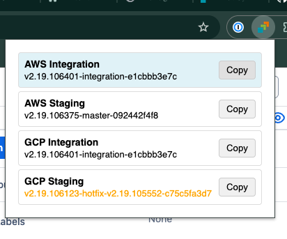

# Mist admin-ui version

This is a simple Chrome extension.

## How to Load the Extension in Chrome

1.  Open Chrome and navigate to `chrome://extensions`.
2.  Enable "Developer mode" using the toggle switch in the top right corner.
3.  Click the "Load unpacked" button.
4.  Select the directory where you have the extension files (e.g., `/Volumes/Dev/MistVersions`).
5.  The extension should now be loaded and visible in your extensions list.

## How to Change the Title of the Extension

1.  Open the `manifest.json` file of the extension in a code editor.
2.  Look for the `"name"` field in the JSON structure.
3.  Change the value of the `"name"` field to your desired title.
4.  Save the `manifest.json` file.
5.  Reload the extension in Chrome by clicking the "Reload" button on the `chrome://extensions` page.
